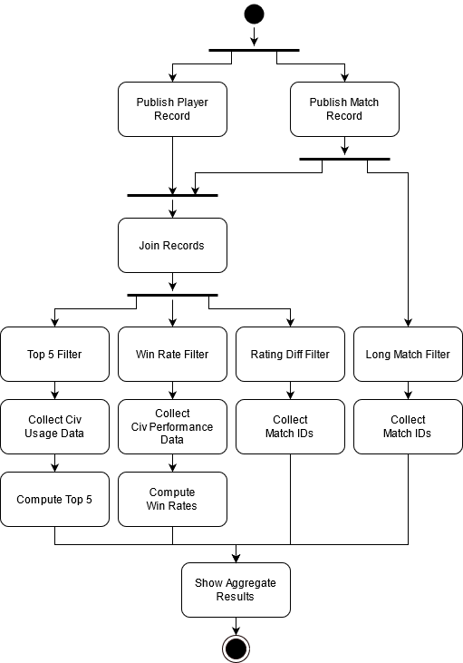
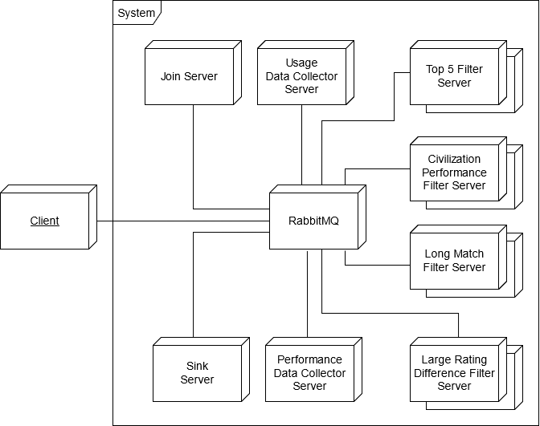

> **Indicaciones para la ejecución**: antes de ejecutar el sistema hay que copiar los archivos matches.csv y match_players.csv al directorio data; los archivos no fueron subidos al repositorio por su tamaño.


# TP2: Middleware y Coordinación de Procesos

*75.74, Sistemas Distribuidos, FIUBA.*

Adrián Barreal, padrón 95137.


## Introducción

Se solicita un sistema distribuido que procese el detalle de partidas jugadas en el videojuego Age of Empires DE. La información será provista en archivos CSV. Con el procesamiento se espera obtener la siguiente información:

* IDs de partidas que excedieron las dos horas de juego por pro players (*average_rating > 2000*) en los servidores *koreacentral*, *southeastasia* y *eastus*.
* IDs de partidas 1v1 donde el ganador tiene un rating 30% menor al perdedor y el rating del ganador es superior a 1000.
* Porcentaje de victorias por civilización en partidas 1v1 (*ladder == RM_1v1*) con civilizaciones diferentes en mapa *arena*.
* Top 5 civilizaciones más usadas por pro players (*rating > 2000*) en team games (*ladder == RM_TEAM*) en el mapa *islands*.


**Requerimientos no funcionales**

* El sistema debe estar optimizado para entornos multicomputadoras.
* El sistema debe ser invocado desde un nodo que transmite los datos a ser procesados.
* Se debe soportar el escalamiento de los elementos de cómputo.
* De ser necesaria una comunicación basada en grupos, se requiere la definición de un middleware.
* El diseño debe permitir una fácil adaptación a otros datasets de partidas de AoE II DE.
* Debido a restricciones en el tiempo de implementación, se permite la construcción de un sistema acoplado al modelo de negocio No es un requerimiento la creación de una plataforma de procesamiento de datos.


## Vista lógica

El sistema a diseñar debe poder procesar en forma paralelizable un conjunto de datos con las características y acorde a un flujo de datos que se describen en las próximas secciones.


#### Análisis de los datos de entrada

El set de datos consiste en dos archivos:

* `matches.csv`: Contiene información sobre las partidas jugadas, una por fila. Cada partida contiene un campo identificador denominado `token`.
* `match_players.csv`: Contiene información sobre los jugadores involucrados en cada partida. El campo `token` identifica al jugador y el campo `match` es una clave foránea que identifica a la partida en `matches.csv`.

Cada partida se identifica mediante un registro con los siguientes campos:

* `token`: Identificador de la partida.
* `winning_team`: Un entero que indica qué jugador ganó la partida. Corresponde al campo `team` del jugador que ganó la partida.
* `mirror`: Si es true, ambos jugadores usan la misma civilización.
* `ladder`: Campo que identifica el tipo de partida. `RM_TEAM` para partidas por equipo, `RM_1v1` para partidas uno contra uno.
* `patch`: Identificador de la versión del juego.
* `average_rating`: Flotante que indica el promedio del rating de los jugadores.
* `map`: Nombre del mapa.
* `map_size`: Tamaño del mapa (e.g. tiny).
* `num_players`: Cantidad de jugadores.
* `server`: Servidor en el que se jugó la partida. Los servidores en el dataset son los siguientes: `australiasoutheast`, `brazilsouth`, `eastus`, `koreacentral`, `southeastasia`, `ukwest`, `westeurope`, `westindia`, `westus2`.
* `duration`: Duración de la partida en formato `hh:mm:ss`.

Cada jugador asociado a una partida se identifica mediante un registro con los siguientes campos:

* `token`: Identificador único del jugador en la partida.
* `match`: Campo correspondiente al token del partido.
* `rating`: Rating del jugador involucrado en la partida.
* `color`: Color del jugador en el juego (e.g. Blue, Green, Red).
* `civ`: Civilización (e.g. Tatars, Aztecs, Khmer, Franks, Persians)
* `team`: Número que identifica al equipo en la partida. En un subconjunto pequeño del set de datos se observan los valores 1 y 2.
* `winner`: Booleano que determina si el jugador ganó la partida o no.


#### Flujo de datos

El flujo de datos a implementar se describe en la figura L.1.


<center>Figura L.1: Flujo de datos</center>

Existen dos fuentes, una de registros de partidas, y otra de registros de jugadores asociados a cada partida. Existen luego cuatro flujos principales, que realizan las siguientes tareas:

1. Determinación de partidas que hayan excedido las dos horas de juego, jugadas por pro players (rating > 2000) en los servidores *koreacentral*, *southeastasia* y *eastus*.
2. Partidas 1v1 donde el ganador haya tenido un rating 30% menor al del perdedor y el rating del ganador sea superior a 1000.
3. Porcentaje de victorias por civilización en partidas 1v1 con civilizaciones diferentes en el mapa *arena*.
4. Top 5 de civilizaciones más usadas por pro players (rating > 2000) en partidas en equipo en el mapa *islands*.


## Vista de desarrollo


#### Estructura del software

Para maximizar la capacidad de procesamiento en paralelo se adoptó un esquema distribuido donde las tareas de procesamiento de datos se dividen entre varios nodos independientes. Para simplificar la comunicación y permitirle a los nodos ser lo más simples e independientes posible se desarrolló una capa de middleware que permite un uso como el que se esquematiza en la figura L.2.


<center>Figura L.2: Middleware.</center>

El middleware consiste principalmente en objetos de tipo Record, que encapsulan las unidades de datos que el sistema permite intercambiar, Publishers, que ofrecen la capacidad de publicar objetos de tipo Record, y Consumers, consumidores que permiten consumir datos de distintas fuentes expuestas por el middleware en forma genérica. Existen también clases comunes pero sirven más bien de infraestructura para implementar  los publishers y los consumers.

Con este middleware en su lugar, cada nodo puede ser implementado con total libertad y con la arquitectura que se considere adecuada, utilizando el middleware como capa de comunicación. En el código demostrativo se adoptaron para los nodos arquitecturas muy simples, pero en una implementación más refinada pueden ser tan complejas y tener tantas capas como se considere necesario.

El middleware, adicionalmente, si bien internamente utiliza RabbitMQ, no expone esta característica en su interfaz, con lo cual es posible reemplazarlo por otro sistema de mensajería si eventualmente fuera necesario.


#### Implementación del software demostrativo

Para la prueba de concepto se implementó un mono-binario que ejecuta uno de varios módulos acorde a un argumento que recibe. El código del binario `main` es concretamente el siguiente:

```golang
func main() {
	// Run the specific node depending on program parameters.
	program := os.Args[1]

	log.Printf("starting program: %s\n", program)

	switch program {
	case "client":
		client.Run()
	case "lmfilter":
		filter.RunLongMatchFilter()
	case "lrdfilter":
		filter.RunLargeRatingDifferenceFilter()
	case "top5filter":
		filter.RunCivilizationUsageCountFilter()
	case "civperformancefilter":
		filter.RunCivilizationVictoryDataFilter()
	case "join":
		join.Run()
	case "sink":
		sink.Run()
	default:
		log.Println("unexpected program name")
	}
}
```

Cada módulo corresponde a un proceso tal como se describe en la vista de procesos. Concretamente, la correspondencia es la siguiente:

* `client`: Es el cliente que ingresa datos al sistema.
* `lmfilter`: Es el filtro encargado de identificar partidas largas (Long Match Filter).
* `lrdfilter`: Es el filtro encargado de identificar partidas en las que el ganador tiene un rating al menos 30% menor que el perdedor (Large Rating Difference Filter, o Rating Diff Filter en la vista de procesos).
* `top5filter`: Es el filtro encargado de identificar partidas y publicar resultados sobre el uso de civilizaciones por jugadores pro en el mapa islands, para calcular eventualmente el top 5.
* `civperformancefilter`: Es el filtro encargado de identificar partidas y publicar resultados sobre victorias y derrotas de civilizaciones en el mapa arena para determinar eventualmente el rendimiento de cada una (Win Rate Filter en la vista de procesos).
* `join`: Es el proceso encargado de realizar el join de los datos.
* `sink`: Es el proceso encargado de recibir identificadores de partidas y resultados provenientes de los filtros y realizar agregaciones o calcular y presentar estadísticas.

En principio, cada módulo está pensado para ser un agente o proceso independiente que depende de la capa de middleware, compartida por todos los componentes, para realizar sus tareas de comunicación. En una implementación más refinada sería adecuado separar en proyectos independientes, o al menos separar el cliente del código del sistema. Todos los módulos dependen del middleware, y no existen dependencias entre módulos, con lo cual no existe nada que impida separar si fuera necesario hacerlo.

El cliente implementado es uno también demostrativo, que lee simplemente los archivos de partidas y de jugadores, en dos hilos distintos, y utiliza la capa de middleware para publicar los registros. 


## Vista de procesos

En la figura P.1 se muestra un diagrama de robustez que describe las características del sistema a implementar.


<center>Figura P.1: Diagrama de robustez del sistema a implementar.</center>


El sistema implementa un procesamiento online y cuenta con los siguientes elementos:

**Match Data Input Server** y **Player Data Input Server**: Los servidores a los que se conecta el cliente y en paralelo provee los datos de las partidas y de los jugadores. Los servidores construyen registros de partidas y jugadores, respectivamente, en base a los datos que reciben, y los publican a través de un exchange correspondiente.

**Match Record FanOut**: Un exchange tipo FanOut que recibe registros de partidas y los hace disponibles a todos sus suscriptores. 

**Player Record FanOut**: Un exchange tipo FanOut que recibe registros de jugadores y los hace disponibles a todos sus suscriptores.

**Long Match LB**: Un balanceador de carga que recibe registros de partidas y los coloca en una cola de la que leen workers que identifican partidas largas acorde al flujo 1. En la implementación se utilizó simplemente una cola compartida por todos los workers.

**Long Match Filter**: El elemento que implementa el filtro del flujo 1. Recibido un registro de partida, el proceso determina si el rating promedio es mayor a 2000, si se jugó en koreacentral, southeastasia o en eastus, y si la partida excedió las dos horas de juego. En tal caso, emite el ID de la partida por una cola de salida.

**Online Join**: Un join online. El proceso almacena los registros que recibe en un cache hasta que cuenta con todos los elementos necesarios para construir un registro completo. Cuando el join construye un registro, lo publica a través de un exchange. Luego de construir un registro, sus componentes son eliminados del cache. En la implementación demostrativa se utilizó un único Join. En una implementación que requiera más capacidad de escalamiento se puede tener múltiples procesos Join, cada uno encargado de un subconjunto de partidas e.g. aquellas cuyo token comienza con `a`, aquellas cuyo token comienza con `b`, etc., o fragmentadas en base a cualquier otro esquema que se considere adecuado.

**Record FanOut**: Un exchange de tipo FanOut de registros completos, que contienen información sobre partidas y sus jugadores.

**Top 5 LB**: Un balanceador de carga que recibe registros post-join y los coloca en una cola de la que leen workers que implementan el flujo 4. En la implementación se utilizó simplemente una cola compartida por todos los workers.

**Top 5 Filter**: El elemento que implementa el flujo 4. Este proceso toma un registro completo y determina si se trata de una partida por equipos, si el mapa es islands, y para aquellos jugadores con rating mayor a 2000, toma nota de la civilizacion utilizada. Cuando el proceso toma nota de una civilización, emite por una cola un registro que indica que un jugador pro usó la civilización en cuestión en islands. Esto permite a un proceso downstream ir recolectando estadísticas online, manteniendo registro de la cantidad de veces que cada civilización fue usada en islands.

**Win Rate LB**: Un balanceador de carga que recibe registros post-join y los coloca en una cola de la que leen workers que implementan el flujo 3. En la implementación se utilizó simplemente una cola compartida por todos los workers.

**Win Rate Filter**: El elemento que implementa el flujo 3. Este proceso toma un registro completo y determina si es una partida 1v1, si es en el mapa arena, y si las civilizaciones son distintas. En tal caso, determina qué civilización ganó y emite un registro a través de una cola indicando que la civilización ganadora ganó en arena y la civilización perdedora perdió. Esto le permite a un proceso downstream ir recolectando estadísticas online, manteniendo registro de la cantidad de victorias y derrotas para cada civilización en arena y calculando el correspondiente porcentaje.

**Rating Diff LB**: Un balanceador de carga que recibe registros post-join y los coloca una cola de la que leen workers que implementan el flujo 2. En la implementación se utilizó simplemente una cola compartida por todos los workers.

**Rating Diff Filter**: El elemento que implementa el flujo 2. Se trata de un filtro que, recibido un registro post-join, determina si se trata de una partida 1v1 en la que el ganador tiene rating mayor a 1000 y al menos 30% menor que el del contrincante. En tal caso, emite una notificación por una cola de salida indicando el ID de la partida.

**Sink**: El proceso que recolecta los resultados para cada flujo y los almacena en un repositorio para futuras consultas. Debido a las características de la información que se transmite por las colas de entrada, pueden existir múltiples procesos Sink idénticos que guardan un subconjunto de los datos recolectados post-proceso (e.g. subconjuntos de partidas largas y de partidas donde el ganador tenga rating al menos 30% menor que el del perdedor, contadores para las victorias y derrotas por civilización, y contadores para la cantidad de usos por civilización). Luego, estas estadísticas pueden ser agregadas periódicamente a un único almacén, o agregadas en forma dinámica cuando se realiza una consulta mediante algún sistema a definir. En la implementación demostrativa existe un único Sink, no obstante, que emite un reporte de estadísticas en forma periódica.


Las actividades a realizar son esencialmente las que se describen en el diagrama de la figura P.2.



<center>Figura P.2: Diagrama de actividades que describe las tareas que realiza esencialmente el sistema.</center>

Existe por un lado un proceso que publica registros de partidas, y otro que publica registros de jugadores. Ambos pueden operar en forma independiente y en paralelo. Para aquellos flujos de procesamiento que dependan únicamente de uno de los dos tipos de registros, el procesamiento y la recolección de resultados puede comenzar en forma inmediata, como es el caso para el flujo que identifica partidas largas. Para los demás flujos es necesario ejecutar un proceso de join que, una vez realizado, puede ser seguido de una nueva paralelización. Los conjuntos de datos resultado de cada rama de procesamiento son independientes unos de otros, con lo cual es posible almacenarlos por separado y eventualmente mostrarlos por separado cuando sea solicitado. Ya que estos conjuntos de datos son pequeños, adicionalmente (e.g. victorias y derrotas por civilización), es posible calcular las estadísticas rápidamente a demanda. Ya que no se requiere un procesamiento con agregación por etapas, es posible implementar un algoritmo online, asumiendo consistencia eventual.


## Vista física

Acorde a lo que se mencionó sobre los módulos o procesos que hacen al sistema en la vista de desarrollo, estos componentes son independientes entre ellos y dependen todos de la capa de middleware. En otras palabras, nada impide que cada uno sea ejecutado en una computadora distinta. En la figura F.1, por ejemplo, se esquematiza un despliegue posible.



<center>Figura F.1: Posible despliegue con un Rabbit centralizado.</center>

Cada nodo cuenta con el paquete de middleware y con el paquete que le corresponde para realizar sus tareas. La correspondencia, acorde a los nombres de programa indicados en la vista de desarrollo para el mono-binario demostrativo, es la siguiente:

* Client: `client`
* Join: `join`
* Top 5 most used filter: `top5filter`
* Civilization performance filter: `civperformancefilter`
* Long match filter: `lmfilter`
* Large rating difference filter: `lrdfilter`
* Sink: `sink`

En la figura, uno de los filtros cuenta con dos instancias, a modo de ejemplo. Las instancias saben comunicarse a la cola adecuada y el sistema distribuye la carga en modalidad work-queue, con lo cual se puede contar con una cantidad arbitraria de instancias. Lo mismo aplica a todos los filtros. El sistema demostrativo no soporta múltiples Sinks ni Joins, no obstante, si bien en la vista de procesos se sugiere cómo podrían implementarse mecanismos de escalamiento en estos procesos.

Si RabbitMQ resultara ser un cuello de botella, también es posible adoptar un esquema diferente en el que se utilizan múltiples instancias, con cada una responsable de un subconjunto de colas o exchanges.

#### Despliegue

En el sistema demostrativo todos los nodos salvo el cliente intentarán conectarse al servidor de Rabbit al inicio de la ejecución. Si la conexión falla, intentarán nuevamente tras algunos segundos. El cliente, por otro lado, en el sistema demostrativo esperará 30 segundos antes de conectarse al servidor de Rabbit y comenzar a enviar datos.

En un esquema productivo, se esperaría que el sistema se encuentre totalmente funcional antes de aceptar conexiones de clientes. En tal caso, y para hacer al sistema más robusto, podría implementarse algún mecanismo de notificaciones o health checks para asegurar que todos los nodos están activos y listos antes de aceptar datos por parte del cliente.


## Casos de uso


#### Determinación de una partida larga

1. El cliente lee una línea del archivo de partidas. Supongamos que se trata efectivamente de una partida larga (duración mayor a 2 horas) que cumple adicionalmente con todos los requisitos para calificar como interesante para el flujo 1.
2. El cliente construye un objeto de tipo MatchRecord en base a los datos levantados del archivo. Para simplificar la construcción y encapsular la estructura del registro, el middleware ofrece funcionalidad que abstrae el proceso.
3. El cliente envía el registro al MatchRecordFanout, donde se hace disponible a múltiples interesados.
4. Uno de los interesados es el Long Match Filter, que obtiene una copia del registro. Estrictamente hablando, pueden existir múltiples instancias del filtro y solo una obtendrá la copia dentro del conjunto de los Long Match Filters. Los demás componentes interesados recibirán no obstante sus propias copias, que podrían o no ser a su vez asignadas a uno entre varios workers.
5. El Long Match Filter determina si la partida cumple con los requisitos para ser de interés acorde al flujo de partidas largas. De serlo, el filtro construirá un objeto de tipo SingleTokenRecord, utilizado para realizar notificaciones relacionadas a un token particular. En este caso, se trata de una notificación sobre una partida larga; el token que guarda el registro es efectivamente el de la partida.
6. El Long Match Filter publica el registro construido a través de una cola. En la implementación demostrativa se utilizó un exchange de tipo Direct, aunque no es estrictamente necesario.
7. En el otro extremo de la cola, un nodo Sink recibe el registro y almacena el token como una partida larga. El nodo sabe que se trata de una partida larga a pesar de tratarse solamente de un SingleTokenRecord por la cola a través de la que llega.
8. Eventualmente el nodo Sink emite estadísticas y datos almacenados, incluyendo la cantidad de partidas largas identificadas y un subconjunto de los tokens que componen al conjunto. De implementarse múltiples nodos Sink, cada uno podría almacenar un subconjunto de las partidas largas, agregándolas eventualmente a pedido o a intervalos periódicos.


#### Determinación de la tasa de victoria por civilización

1. El cliente lee una línea del archivo de partidas y construye un registro acorde a lo indicado en la descripción del flujo de identificación de partidas largas. La partida es análogamente publicada a través del Match Record FanOut. Supongamos que se trata de una partida 1v1 con token X que cumple los requisitos para ser de interés al flujo 3 (porcentaje de victorias por civilización en partidas 1v1 con civilizaciones diferentes en el mapa *arena*).
2. El nodo Online Join recibe el registro y, en base a la cantidad de jugadores en la partida (información disponible en el MatchRecord), determina si tiene en su caché la información de todos los jugadores de la partida. Se trata de una partida 1v1, con lo cual requiere contar precisamente con dos jugadores. El proceso todavía no cuenta con la información necesaria, con lo cual almacena el registro indexado por match token. En la implementación demostrativa se utilizó un hash map.
3. El cliente lee una línea del archivo de jugadores y construye un registro de tipo PlayerRecord. Supongamos que se trata de un  jugador de la partida con token X. El cliente publica el registro a través del exchange Player Record FanOut.
4. El nodo Online Join recibe el registro y, en base al token X de la partida del jugador, determina si tiene ya información sobre la partida en cuestión. En este caso la tiene, con la cual determina que necesita precisamente dos jugadores para realizar el join. Como solo tiene uno, guarda el registro del jugador recibido en una colección asociada a la partida X, indexada también por el token X.
5. El cliente publica eventualmente un PlayerRecord a través del Player Record FanOut con información sobre el segundo jugador asociado a la partida X.
6. El nodo Online Join recibe el registro del jugador y, en base al token X que obtiene del registro, obtiene nuevamente la información asociada a la partida X y determina que necesita dos jugadores para realizar el join. Buscando en la colección de jugadores asociados a la partida X determina que, junto al nuevo jugador recibido, tiene en total dos y puede efectivamente realizar el join.
7. El nodo Online Join realiza la juntura, generando un registro de tipo JointMatchRecord que contiene información sobre la partida y sobre sus jugadores. El nodo publica el registro a través del Record FanOut. El Online Join elimina toda la información asociada a la partida X de sus cachés para mantener en memoria solo información asociada a registros que todavía no han sido juntados.
8. El filtro Win Filter, o Civilization Performance Filter, recibe el registro y determina si la partida cumple con las condiciones para ser de su interés. Concretamente, determina si la partida es 1v1, si el mapa es arena, y si los jugadores usan civilizaciones distintas. De ser el caso, genera dos registros de tipo CivilizationInfoRecord: uno para la civilización del ganador indicando que hubo una victoria, y otro para la civilización del perdedor indicando que hubo una derrota. Ambos registros son agrupados en un batch de tipo CivilizationInfoRecordBatch y emitidos a través de una cola. Los objetos CivilizationInfoRecord son objetos genéricos que permiten transmitir información asociada a civilizaciones: cuentan con un campo que es el nombre de la civilización y un string adicional que comunica información adicional relacionada a lo que se está queriendo comunicar. En este caso, los valores que adopta el string son "Victory" y "Defeat."
9. El nodo Sink guarda en memoria dos contadores inicializados en forma lazy asociados a cada civilización, que indican respectivamente la cantidad de victorias y la cantidad de derrotas. Cuando Sink recibe el ambos registros CivilizationInfoRecord  actualiza los contadores correspondientes a cada civilización. A la civilización ganadora le suma una victoria, y a la civilización ganadora le suma una derrota. De implementarse múltiples nodos Sink, cada uno podría almacenar contadores independientes para cada civilización y agregarlos eventualmente cuando haya que generar las estadísticas, o en forma periódica con consistencia eventual.
10. El nodo Sink eventualmente emite estadísticas sobre la tasa de victoria para cada civilización, calculándola en base a la cantidad de victorias y derrotas que tiene registradas para cada una.


#### Determinación del top 5 de civilizaciones más usadas por pros en islands

1. El flujo comienza en forma análoga al que se describe en la sección anterior, con el nodo Online Join emitiendo eventualmente un registro JointMatchRecord con información sobre la partida y sobre todos los jugadores asociados a ella. Supongamos que la partida cumple efectivamente con las condiciones para ser de interés al flujo 4 (top 5 de civilizaciones más usadas por pro players (rating > 2000) en partidas en equipo en el mapa *islands*).
2. El filtro o uno de los filtros Top 5 Filter recibe el registro y determina si cumple con las condiciones para ser de interés al ya mencionado flujo. Determinando que es el caso, construye un registro de tipo CivilizationInfoRecord por cada jugador pro en la partida, indicando la civilización que usó, y los junta en un batch. El batch es enviado a través de una cola.
3. El nodo Sink guarda contadores en memoria para cada civilización, inicializados en forma lazy, que indican la cantidad de veces que cada civilización fue usada por pro players en partidas por equipo en el mapa islands. En base a los registros tipo CivilizationInfoRecord que recibe a través de la cola asociada al mencionado flujo, aumenta en uno (para cada registro) el contador correspondiente a la civilización indicada en el registro. Como en los casos anteriores, es posible contar con múltiples nodos Sink que guarden contadores independientes que eventualmente sean agregados cuando haya que mostrar resultados o a intervalos periódicos con consistencia eventual.
4. Eventualmente el nodo Sink genera estadísticas. En este momento determinará el top 5 de civilizaciones más usadas en base a los contadores que guarda en memoria, y mostrará los resultados obtenidos.


## Defectos conocidos

* En la vista de procesos se propone la posibilidad de implementar múltiples procesos Sink. En el sistema demostrativo se utiliza uno solo. De implementarse varios, no obstante, cada uno almacenaría solo un subconjunto de los datos (e.g. contadores para cada civilización, IDs de partidas interesantes), con lo cual sería necesario implementar un paso de agregación adicional, probablemente mediante una cola para poder desacoplar los múltiples procesos Sink en nodos distintos.
* El proceso Join es uno solo, lo cual reduce las posibilidades de escalamiento. Esto podría resolverse teniendo múltiples instancias, cada una encargada de un subconjunto de partidas. La partición puede hacerse sin dificultad usando el token de partida.
* Los resultados obtenidos no parecerían ser acordes a los esperados. También se observó una excepción durante una de las ejecuciones del sistema demostrativo, con lo cuál existe definitivamente algún error que requiere corrección.

