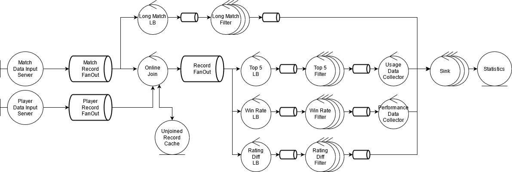

# TP2: Middleware y Coordinación de Procesos

*75.74, Sistemas Distribuidos, FIUBA.*

## Introducción

Se solicita un sistema distribuido que procese el detalle de partidas jugadas en el videojuego Age of Empires DE. La información será provista en archivos CSV. Con el procesamiento se espera obtener la siguiente información:

* IDs de partidas que excedieron las dos horas de juego por pro players (*average_rating > 2000*) en los servidores *koreacentral*, *southeastasia* y *eastus*.
* IDs de partidas 1v1 donde el ganador tiene un rating 30% menor al perdedor y el rating del ganador es superior a 1000.
* Porcentaje de victorias por civilización en partidas 1v1 (*ladder == RM_1v1*) con civilizaciones diferentes en mapa *arena*.
* Top 5 civilizaciones más usadas por pro players (*rating > 2000*) en team games (*ladder == RM_TEAM*) en el mapa *islands*.

**Requerimientos no funcionales**

* El sistema debe estar optimizado para entornos multicomputadoras.
* El sistema debe ser invocado desde un nodo que transmite los datos a ser procesados.
* Se debe soportar el escalamiento de los elementos de cómputo.
* De ser necesaria una comunicación basada en grupos, se requiere la definición de un middleware.
* El diseño debe permitir una fácil adaptación a otros datasets de partidas de AoE II DE.
* Debido a restricciones en el tiempo de implementasión, se permite la construcción de un sistema acoplado al modelo de negocio No es un requerimiento la creación de una plataforma de procesamiento de datos.

## Análisis de los datos de entrada

El set de datos consiste en dos archivos:

* `matches.csv`: Contiene información sobre las partidas jugadas, una por fila. Cada partida contiene un campo identificador denominado `token`.
* `match_players.csv`: Contiene información sobre los jugadores involucrados en cada partida. El campo `token` identifica al jugador y el campo `match` es una clave foranea que identifica a la partida en `matches.csv`.

Cada partida se identifica mediante un registro con los siguientes campos:

* `token`: Identificador de la partida.
* `winning_team`: Un entero que indica qué jugador ganó la partida. Corresponde al campo `team` del jugador que ganó la partida.
* `mirror`: Si es true, ambos jugadores usan la misma civilización.
* `ladder`: Campo que identifica el tipo de partida. `RM_TEAM` para partidas por equipo, `RM_1v1` para partidas uno contra uno.
* `patch`: Identificador de la versión del juego.
* `average_rating`: Flotante que indica el promedio del rating de los jugadores.
* `map`: Nombre del mapa.
* `map_size`: Tamaño del mapa (e.g. tiny).
* `num_players`: Cantidad de jugadores.
* `server`: Servidor en el que se jugó la partida. Los servidores en el dataset son los siguientes: `australiasoutheast`, `brazilsouth`, `eastus`, `koreacentral`, `southeastasia`, `ukwest`, `westeurope`, `westindia`, `westus2`.
* `duration`: Duración de la partida en formato `hh:mm:ss`.

Cada jugador asociado a una partida se identifica mediante un registro con los siguientes campos:

* `token`: Identificador único del jugador en la partida.
* `match`: Campo correspondiente al token del partido.
* `rating`: Rating del jugador involucrado en la partida.
* `color`: Color del jugador en el juego (e.g. Blue, Green, Red).
* `civ`: Civilización (e.g. Tatars, Aztecs, Khmer, Franks, Persians)
* `team`: Número que identifica al equipo en la partida. En un subconjunto pequeño del set de datos se observan los valores 1 y 2.
* `winner`: Booleano que determina si el jugador ganó la partida o no.

## Flujo de datos

El flujo de datos a implementar se describe en la figura 1.

Figura 1: Flujo de datos

Existen dos fuentes, una de registros de partidas, y otra de registros de jugadores asociados a cada partida. Existen luego cuatro flujos principales, que realizan las siguientes tareas:

1. Determinación de partidas que hayan excedido las dos horas de juego, jugadas por pro players (rating > 2000) en los servidores *koreacentral*, *southeastasia* y *eastus*.
2. Partidas 1v1 donde el ganador haya tenido un rating 30% menor al del perdedor y el rating del ganador sea superior a 1000.
3. Porcentaje de victorias por civilización en partidas 1v1 con civilizaciones diferentes en el mapa *arena*.
4. Top 5 de civilizaciones más usadas por pro players (rating > 2000) en partidas en equipo en el mapa *islands*.

## Vista de procesos

En la figura P.1 se muestra un diagrama de robustez que describe las características del sistema a implementar.

Figura P.1: Diagrama de robustez del sistema a implementar.

El sistema implementa un procesamiento online y cuenta con los siguientes elementos:

**Match Data Input Server** y **Player Data Input Server**: Los servidores a los que se conecta el cliente y en paralelo provee los datos de las partidas y de los jugadores. Los servidores construyen registros de partidas y jugadores, respectivamente, en base a los datos que reciben, y los publican a través de un exchange correspondiente.

**Match Record FanOut**: Un exchange tipo FanOut que recibe registros de partidas y los hace disponibles a todos sus suscriptores. 

**Player Record FanOut**: Un exchange tipo FanOut que recibe registros de jugadores y los hace disponibles a todos sus suscriptores.

**Long Match LB**: Un balanceador de carga que recibe registros de partidas y los coloca en una cola de la que leen workers que identifican partidas largas acorde al flujo 1.

**Long Match Filter**: El elemento que implementa el filtro del flujo 1. Recibido un registro de partida, el proceso determina si el rating promedio es mayor a 2000, si se jugó en koreacentral, southeastasia o en eastus, y si la partida excedió las dos horas de juego. En tal caso, emite el ID de la partida por una cola de salida.

**Online Join**: Un join online. El proceso almacena los registros que recibe en un cache hasta que cuenta con todos los elementos necesarios para construir un registro completo. Cuando el join construye un registro, lo publica a través de un exchange. Luego de construir un registro, sus componentes son eliminados del cache.

**Record FanOut**: Un exchange de tipo FanOut de registros completos, que contienen información sobre partidas y sus jugadores.

**Top 5 LB**: Un balanceador de carga que recibe registros post-join y los coloca en una cola de la que leen workers que implementan el flujo 4.

**Top 5 Filter**: El elemento que implementa el flujo 4. Este proceso toma un registro completo y determina si se trata de una partida por equipos, si el mapa es islands, y para aquellos jugadores con rating mayor a 2000, toma nota de la civilizacion utilizada. Cuando el proceso toma nota de una civilización, emite por una cola un registro que indica que un jugador pro usó la civilización en cuestión en islands. Esto permite a un proceso downstream ir recolectando estadísticas online, manteniendo registro de la cantidad de veces que cada civilización fue usada en islands.

**Win Rate LB**: Un balanceador de carga que recibe registros post-join y los coloca en una cola de la que leen workers que implementan el flujo 3.

**Win Rate Filter**: El elemento que implementa el flujo 3. Este proceso toma un registro completo y determina si es una partida 1v1, si es en el mapa arena, y si las civilizaciones son distintas. En tal caso, determina qué civilización ganó y emite un registro a través de una cola indicando que la civilización ganadora ganó en arena y la civilización perdedora perdió. Esto le permite a un proceso downstream ir recolectando estadísticas online, manteniendo registro de la cantidad de victorias y derrotas para cada civilización en arena y calculando el correspondiente porcentaje.

**Rating Diff LB**: Un balanceador de carga que recibe registros post-join y los coloca una cola de la que leen workers que implementan el flujo 2.

**Rating Diff Filter**: El elemento que implementa el flujo 2. Se trata de un filtro que, recibido un registro post-join, determina si se trata de una partida 1v1 en la que el ganador tiene rating mayor a 1000 y al menos 30% menor que el del contrincante. En tal caso, emite una notificación por una cola de salida indicando el ID de la partida.

**Sink**: El proceso que recolecta los resultados para cada flujo y los almacena en un repositorio para futuras consultas.
