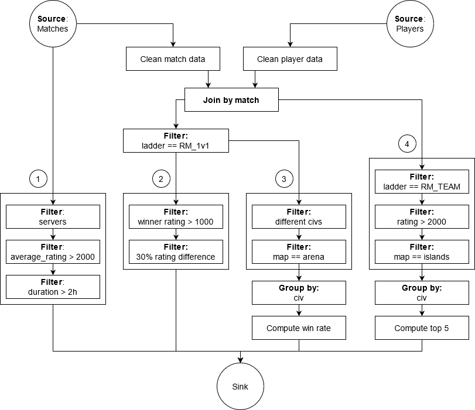

> **Indicaciones para la ejecución**: antes de ejecutar el sistema hay que copiar los archivos matches.csv y match_players.csv al directorio data; los archivos no fueron subidos al repositorio por su tamaño.

> #### Resumen de cambios para la re-entrega
>
> * Se le quitaron al nodo Sink las responsabilidades de cálculo de estadísticas. Dicha responsabilidad se implementó en dos procesos Performance Data Collector y Usage Data Collector para los flujos 3 y 4, respectivamente. El proceso Sink ahora solo recibe estadísticas y las muestra en forma periódica.
> * A nivel código se refactorizó la lógica de los consumidores en `middleware.go`  mediante un tipo `abstractConsumer` que concentra la responsabilidad de recibir mensajes desde Rabbit. Se utiliza el patrón select-case de Golang para atender tanto a nuevos mensajes como a pedidos de finalización del proceso.
> * A nivel código se utiliza más el mecanismo defer de Golang para asegurar el cierre adecuado de las conexiones. No para todos los recursos, incluyendo archivos, no obstante, ya que defer no puede ser utilizado si el método Close puede devolver un error.
> * Se modificó el código del cliente para reducir la repetición y para utilizar el quitChannel que antes no se usaba.
> * Se eliminó el archivo `process.go` que no era utilizado. Se eliminó también el método `Queue` del tipo `Connector` que no era utilizado y exponía detalles internos sobre la implementación del middleware.
> * Se modificó la documentación para que sea acorde al nuevo sistema y para reflejar los cambios solicitados.
> * Se corrigió un bug en el proceso join que impedía que se identificaran partidas que podían joinearse. Con el cambio se obtuvieron resultados acordes a los de la demostración de Kaggle.


# TP2: Middleware y Coordinación de Procesos

*75.74, Sistemas Distribuidos, FIUBA.*

Adrián Barreal, padrón 95137.


## Introducción

Se solicita un sistema distribuido que procese el detalle de partidas jugadas en el videojuego Age of Empires DE. La información será provista en archivos CSV. Con el procesamiento se espera obtener la siguiente información:

* IDs de partidas que excedieron las dos horas de juego por pro players (*average_rating > 2000*) en los servidores *koreacentral*, *southeastasia* y *eastus*.
* IDs de partidas 1v1 donde el ganador tiene un rating 30% menor al perdedor y el rating del ganador es superior a 1000.
* Porcentaje de victorias por civilización en partidas 1v1 (*ladder == RM_1v1*) con civilizaciones diferentes en mapa *arena*.
* Top 5 civilizaciones más usadas por pro players (*rating > 2000*) en team games (*ladder == RM_TEAM*) en el mapa *islands*.


**Requerimientos no funcionales**

* El sistema debe estar optimizado para entornos multicomputadoras.
* El sistema debe ser invocado desde un nodo que transmite los datos a ser procesados.
* Se debe soportar el escalamiento de los elementos de cómputo.
* De ser necesaria una comunicación basada en grupos, se requiere la definición de un middleware.
* El diseño debe permitir una fácil adaptación a otros datasets de partidas de AoE II DE.
* Debido a restricciones en el tiempo de implementación, se permite la construcción de un sistema acoplado al modelo de negocio No es un requerimiento la creación de una plataforma de procesamiento de datos.


## Vista lógica

El sistema a diseñar debe poder procesar en forma paralelizable un conjunto de datos con las características y acorde a un flujo de datos que se describen en las próximas secciones.


#### Análisis de los datos de entrada

El set de datos consiste en dos archivos:

* `matches.csv`: Contiene información sobre las partidas jugadas, una por fila. Cada partida contiene un campo identificador denominado `token`.
* `match_players.csv`: Contiene información sobre los jugadores involucrados en cada partida. El campo `token` identifica al jugador y el campo `match` es una clave foránea que identifica a la partida en `matches.csv`.

Cada partida se identifica mediante un registro con los siguientes campos:

* `token`: Identificador de la partida.
* `winning_team`: Un entero que indica qué jugador ganó la partida. Corresponde al campo `team` del jugador que ganó la partida.
* `mirror`: Si es true, ambos jugadores usan la misma civilización.
* `ladder`: Campo que identifica el tipo de partida. `RM_TEAM` para partidas por equipo, `RM_1v1` para partidas uno contra uno.
* `patch`: Identificador de la versión del juego.
* `average_rating`: Flotante que indica el promedio del rating de los jugadores.
* `map`: Nombre del mapa.
* `map_size`: Tamaño del mapa (e.g. tiny).
* `num_players`: Cantidad de jugadores.
* `server`: Servidor en el que se jugó la partida. Los servidores en el dataset son los siguientes: `australiasoutheast`, `brazilsouth`, `eastus`, `koreacentral`, `southeastasia`, `ukwest`, `westeurope`, `westindia`, `westus2`.
* `duration`: Duración de la partida en formato `hh:mm:ss`.

Cada jugador asociado a una partida se identifica mediante un registro con los siguientes campos:

* `token`: Identificador único del jugador en la partida.
* `match`: Campo correspondiente al token del partido.
* `rating`: Rating del jugador involucrado en la partida.
* `color`: Color del jugador en el juego (e.g. Blue, Green, Red).
* `civ`: Civilización (e.g. Tatars, Aztecs, Khmer, Franks, Persians)
* `team`: Número que identifica al equipo en la partida. En un subconjunto pequeño del set de datos se observan los valores 1 y 2.
* `winner`: Booleano que determina si el jugador ganó la partida o no.


#### Flujo de datos

El flujo de datos a implementar se describe en la figura L.1.



<center>Figura L.1: Flujo de datos</center>

Existen dos fuentes, una de registros de partidas, y otra de registros de jugadores asociados a cada partida. Existen luego cuatro flujos principales, que realizan las siguientes tareas:

1. Determinación de partidas que hayan excedido las dos horas de juego, jugadas por pro players (rating > 2000) en los servidores *koreacentral*, *southeastasia* y *eastus*.
2. Partidas 1v1 donde el ganador haya tenido un rating 30% menor al del perdedor y el rating del ganador sea superior a 1000.
3. Porcentaje de victorias por civilización en partidas 1v1 con civilizaciones diferentes en el mapa *arena*.
4. Top 5 de civilizaciones más usadas por pro players (rating > 2000) en partidas en equipo en el mapa *islands*.


## Vista de procesos

Las actividades a realizar son esencialmente las que se describen en el diagrama de la figura P.1.


<center>Figura P.1: Diagrama de actividades que describe las tareas que realiza esencialmente el sistema.</center>

Existe por un lado un proceso que publica registros de partidas, y otro que publica registros de jugadores. Ambos pueden operar en forma independiente y en paralelo. Para aquellos flujos de procesamiento que dependan únicamente de uno de los dos tipos de registros, el procesamiento y la recolección de resultados puede comenzar en forma inmediata, como es el caso para el flujo que identifica partidas largas. Para los demás flujos es necesario ejecutar un proceso de join que, una vez realizado, puede ser seguido de una nueva paralelización. Los conjuntos de datos resultado de cada rama de procesamiento son independientes unos de otros, con lo cual es posible almacenarlos por separado y eventualmente mostrarlos por separado cuando sea solicitado. En el sistema demostrativo, no obstante, existe un paso de agregación que combina los resultados y los muestra todos juntos. En cualquier caso, ya que estos conjuntos de datos son pequeños (e.g. victorias y derrotas por civilización), sería también posible calcular las estadísticas rápidamente a demanda.


## Vista física

En la figura F.1 se muestra un diagrama de robustez que describe las características del sistema a implementar.


<center>Figura F.1: Diagrama de robustez del sistema a implementar.</center>


El sistema implementa un procesamiento online y cuenta con los siguientes elementos:

**Match Data Input Server** y **Player Data Input Server**: Los servidores a los que se conecta el cliente y en paralelo provee los datos de las partidas y de los jugadores. Los servidores construyen registros de partidas y jugadores, respectivamente, en base a los datos que reciben, y los publican a través de un exchange correspondiente.

**Match Record FanOut**: Un exchange tipo FanOut que recibe registros de partidas y los hace disponibles a todos sus suscriptores. 

**Player Record FanOut**: Un exchange tipo FanOut que recibe registros de jugadores y los hace disponibles a todos sus suscriptores.

**Long Match LB**: Un balanceador de carga que recibe registros de partidas y los coloca en una cola de la que leen workers que identifican partidas largas acorde al flujo 1. En la implementación se utilizó simplemente una cola compartida por todos los workers.

**Long Match Filter**: El elemento que implementa el filtro del flujo 1. Recibido un registro de partida, el proceso determina si el rating promedio es mayor a 2000, si se jugó en koreacentral, southeastasia o en eastus, y si la partida excedió las dos horas de juego. En tal caso, emite el ID de la partida por una cola de salida.

**Online Join**: Un join online. El proceso almacena los registros que recibe en un cache hasta que cuenta con todos los elementos necesarios para construir un registro completo. Cuando el join construye un registro, lo publica a través de un exchange. Luego de construir un registro, sus componentes son eliminados del cache. En la implementación demostrativa se utilizó un único Join. En una implementación que requiera más capacidad de escalamiento se puede tener múltiples procesos Join, cada uno encargado de un subconjunto de partidas e.g. aquellas cuyo token comienza con `a`, aquellas cuyo token comienza con `b`, etc., o fragmentadas en base a cualquier otro esquema que se considere adecuado.

**Record FanOut**: Un exchange de tipo FanOut de registros completos, que contienen información sobre partidas y sus jugadores.

**Top 5 LB**: Un balanceador de carga que recibe registros post-join y los coloca en una cola de la que leen workers que implementan el flujo 4. En la implementación se utilizó simplemente una cola compartida por todos los workers.

**Top 5 Filter**: El elemento que identifica partidas acordes a los requisitos del flujo 4. Este proceso toma un registro completo y determina si se trata de una partida por equipos, si el mapa es islands, y para aquellos jugadores con rating mayor a 2000, toma nota de la civilizacion utilizada. Cuando el proceso toma nota de una civilización, emite por una cola un registro que indica que un jugador pro usó la civilización en cuestión en islands. Esto permite a un proceso downstream ir recolectando datos online, manteniendo registro de la cantidad de veces que cada civilización fue usada en el mapa.

**Usage Data Collector**: Recolecta los resultados emitidos por el proceso Top 5 Filter y los almacena para calcular el Top 5 de las civilizaciones más usadas para el flujo 4. En otras palabras, se encarga de mantener la cuenta de la cantidad de usos por civilización en las partidas acordes a los requisitos de dicho flujo, y de determinar cuales son las 5 más usadas. Dicho resultado es emitido por una cola. De ser necesario escalar en esta instancia, se puede implementar alternativamente una agregación por etapas, con múltiples nodos manteniendo cuentas independientes y periódicamente emitiendo sus cuentas parciales para que un nodo siguiente realice la agregación a un ritmo más lento. En el sistema demostrativo, no obstante, se implementó una agregación en una única etapa.

**Win Rate LB**: Un balanceador de carga que recibe registros post-join y los coloca en una cola de la que leen workers que implementan el flujo 3. En la implementación se utilizó simplemente una cola compartida por todos los workers.

**Win Rate Filter**: El elemento que identifica partidas acordes a los requisitods del flujo 3. Este proceso toma un registro completo y determina si es una partida 1v1, si es en el mapa arena, y si las civilizaciones son distintas. En tal caso, determina qué civilización ganó y emite un registro a través de una cola indicando que la civilización ganadora ganó en arena y la civilización perdedora perdió. Esto le permite a un proceso downstream ir recolectando datos online, manteniendo registro de la cantidad de victorias y derrotas para cada civilización en arena y calculando la correspondiente tasa de victoria.

**Performance Data Collector**: Recolecta los resultados sobre victorias y derrotas de cada civilización, emitidos por el Win Rate Filter. En otras palabras, mantiene contadores de victorias y derrotas para cada civilización y en base a ellos calcula y emite las tasas de victoria para cada una. De ser necesario escalar en esta instancia, se puede reemplazar por una agregación por etapas, con múltiples nodos manteniendo cuentas parciales y emitiéndolas periódicamente para que un nodo posterior pueda agregarlas y calcular las estadísticas a un ritmo más lento.

**Rating Diff LB**: Un balanceador de carga que recibe registros post-join y los coloca una cola de la que leen workers que implementan el flujo 2. En la implementación se utilizó simplemente una cola compartida por todos los workers.

**Rating Diff Filter**: El elemento que implementa el flujo 2. Se trata de un filtro que, recibido un registro post-join, determina si se trata de una partida 1v1 en la que el ganador tiene rating mayor a 1000 y al menos 30% menor que el del contrincante. En tal caso, emite una notificación por una cola de salida indicando el ID de la partida.

**Sink**: El proceso que recolecta los resultados para cada flujo y los almacena en un repositorio para futuras consultas. El proceso simplemente recolecta y muestra los datos que recibe. En el sistema demostrativo, dicha muestra se hace en forma periódica por salida estándar, aunque puede implementarse cualquier otra variante.


#### Despliegue

Los componentes arriba mencionados fueron implementados tal de ser independientes entre ellos; la comunicación se lleva a cabo mediante una capa de middleware, en el software demostrativo una instancia de RabbitMQ al que los programas acceden a través de una biblioteca que encapsula los detalles concretos (ver vista de desarrollo). Este desacople permite que cada proceso sea ejecutado en una computadora distinta. En la figura F.2 se muestra un despliegue general.


<center>Figura F.2: Despliegue con un servidor centralizado de RabbitMQ.</center>

Cada nodo cuenta con el paquete de middleware y con el paquete que le corresponde para realizar sus tareas. La correspondencia entre nodos de la figura F.2 y procesos de la figura F.1 es la siguiente:

* **Top 5 Filter Server**: Top 5 Filter.
* **Civilization Performance Filter Server**: Win Rate Filter.
* **Long Match Filter Server**: Long Match Filter.
* **Large Rating Difference Filter Server**: Rating Diff Filter.
* **Usage Data Collector Server**: Usage Data Collector.
* **Performance Data Collector Server**: Performance Data Collector.
* **Join Server**: Online Join.
* **Sink Server**: Sink.

Si RabbitMQ resultara ser un cuello de botella, también es posible adoptar un esquema diferente en el que se utilizan múltiples instancias, con cada una responsable de un subconjunto de colas o exchanges.


#### Inicio del sistema

En el sistema demostrativo todos los nodos salvo el cliente intentarán conectarse al servidor de Rabbit al inicio de la ejecución. Si la conexión falla, intentarán nuevamente tras algunos segundos. El cliente, por otro lado, en el sistema demostrativo esperará 30 segundos antes de conectarse al servidor de Rabbit y comenzar a enviar datos.

En un esquema productivo, se esperaría que el sistema se encuentre totalmente funcional antes de aceptar conexiones de clientes. En tal caso, y para hacer al sistema más robusto, podría implementarse algún mecanismo de notificaciones o health checks para asegurar que todos los nodos están activos y listos antes de comenzar a aceptar datos.


## Vista de desarrollo


#### Estructura del software

Para maximizar la capacidad de procesamiento en paralelo se adoptó un esquema distribuido donde las tareas de procesamiento de datos se dividen entre varios nodos independientes. Para simplificar la comunicación y permitirle a los nodos ser lo más simples e independientes posible se desarrolló una capa de middleware orientado a mensajes que permite un uso como el que se esquematiza en la figura L.1.


<center>Figura L.1: Middleware.</center>

El middleware consiste principalmente en objetos de tipo Record, que encapsulan las unidades de datos que el sistema permite intercambiar, Publishers, que ofrecen la capacidad de publicar objetos de tipo Record, y Consumers, consumidores que permiten consumir datos de distintas fuentes expuestas por el middleware en forma genérica. Existen también clases comunes pero sirven más bien de infraestructura para implementar  los publishers y los consumers.

Con este middleware en su lugar, cada nodo puede ser implementado con total libertad y con la arquitectura que se considere adecuada, utilizando el middleware como capa de comunicación. En el código demostrativo se adoptaron para los nodos arquitecturas muy simples, pero en una implementación más refinada pueden ser tan complejas y tener tantas capas como se considere necesario.

El middleware, adicionalmente, si bien internamente utiliza RabbitMQ, no expone esta característica en su interfaz, con lo cual es posible reemplazarlo por otro sistema de mensajería si eventualmente fuera necesario.


#### Implementación del software demostrativo

Para la prueba de concepto se implementó un mono-binario que ejecuta uno de varios módulos acorde a un argumento que recibe. El código del binario `main` es concretamente el siguiente:

```golang
func main() {
	// Run the specific node depending on program parameters.
	program := os.Args[1]

	log.Printf("starting program: %s\n", program)

	switch program {
	case "client":
		client.Run()
	case "lmfilter":
		filter.RunLongMatchFilter()
	case "lrdfilter":
		filter.RunLargeRatingDifferenceFilter()
	case "top5filter":
		filter.RunCivilizationUsageCountFilter()
	case "civperformancefilter":
		filter.RunCivilizationVictoryDataFilter()
	case "join":
		join.Run()
	case "victorydatacollector":
		collector.RunCivilizationVictoryDataCollector()
	case "usagedatacollector":
		collector.RunCivilizationUsageDataCollector()
	case "sink":
		sink.Run()
	default:
		log.Println("unexpected program name")
	}
}
```

Cada módulo corresponde a un proceso tal como se describe en el diagrama de robustez. Concretamente, la correspondencia es la siguiente:

* `client`: Es el cliente que ingresa datos al sistema.
* `lmfilter` (Long Match Filter en el diagrama de robustez): Es el filtro encargado de identificar partidas largas.
* `lrdfilter` (Rating Diff Filter en el diagrama de robustez): Es el filtro encargado de identificar partidas en las que el ganador tiene un rating al menos 30% menor que el perdedor.
* `top5filter` (Top 5 Filter en el diagrama de robustez): Es el filtro encargado de identificar partidas y publicar resultados sobre el uso de civilizaciones por jugadores pro en el mapa islands, para calcular eventualmente el top 5 de civilizaciones más usadas.
* `civperformancefilter` (Win Rate Filter en el diagrama de robustez): Es el filtro encargado de identificar partidas y publicar resultados sobre victorias y derrotas de civilizaciones en el mapa arena para determinar eventualmente el rendimiento de cada una (Win Rate Filter en la vista de procesos).
* `victorydatacollector` (Performance Data Collector en el diagrama de robustez): Es el proceso encargado de recolectar datos sobre las victorias y derrotas de cada civilización y publicar estadísticas sobre la tasa de victoria de cada civilización para el flujo 3.
* `usagedatacollector` (Usage Data Collector en el diagrama de robustez): Es el proceso encargado de recolectar datos sobre el uso de cada civilización y publicar el top 5 de las civilizaciones más usadas para el flujo 4.
* `join`: Es el proceso encargado de realizar el join de los datos.
* `sink`: Es el proceso encargado de recibir identificadores de partidas y resultados provenientes de los filtros y realizar agregaciones o calcular y presentar estadísticas.

En principio, cada módulo está pensado para ser un agente o proceso independiente que depende de la capa de middleware, compartida por todos los componentes, para realizar sus tareas de comunicación. En una implementación más refinada sería adecuado separar en proyectos independientes, o al menos separar el cliente del código del sistema. Todos los módulos dependen del middleware, y no existen dependencias entre módulos, con lo cual no existe nada que impida separar si fuera necesario hacerlo.

El cliente implementado es uno también demostrativo, que lee simplemente los archivos de partidas y de jugadores, en dos hilos distintos, y utiliza la capa de middleware para publicar los registros. 


## Casos de uso


#### Determinación de una partida larga

1. El cliente lee una línea del archivo de partidas. Supongamos que se trata efectivamente de una partida larga (duración mayor a 2 horas) que cumple adicionalmente con todos los requisitos para calificar como interesante para el flujo 1.
2. El cliente construye un objeto de tipo MatchRecord en base a los datos levantados del archivo. Para simplificar la construcción y encapsular la estructura del registro, el middleware ofrece funcionalidad que abstrae el proceso.
3. El cliente envía el registro al MatchRecordFanout, donde se hace disponible a múltiples interesados.
4. Uno de los interesados es el Long Match Filter, que obtiene una copia del registro. Estrictamente hablando, pueden existir múltiples instancias del filtro y solo una obtendrá la copia dentro del conjunto de los Long Match Filters. Los demás componentes interesados recibirán no obstante sus propias copias, que podrían o no ser a su vez asignadas a uno entre varios workers.
5. El Long Match Filter determina si la partida cumple con los requisitos para ser de interés acorde al flujo de partidas largas. De serlo, el filtro construirá un objeto de tipo SingleTokenRecord, utilizado para realizar notificaciones relacionadas a un token particular. En este caso, se trata de una notificación sobre una partida larga; el token que guarda el registro es efectivamente el de la partida.
6. El Long Match Filter publica el registro construido a través de una cola. En la implementación demostrativa se utilizó un exchange de tipo Direct, aunque no es estrictamente necesario.
7. En el otro extremo de la cola, un nodo Sink recibe el registro y almacena el token como una partida larga. El nodo sabe que se trata de una partida larga a pesar de tratarse solamente de un SingleTokenRecord por la cola a través de la que llega.
8. Eventualmente el nodo Sink emite estadísticas y datos almacenados, incluyendo la cantidad de partidas largas identificadas y un subconjunto de los tokens que componen al conjunto. De implementarse múltiples nodos Sink, cada uno podría almacenar un subconjunto de las partidas largas, agregándolas eventualmente a pedido o a intervalos periódicos.


#### Determinación de la tasa de victoria por civilización

1. El cliente lee una línea del archivo de partidas y construye un registro acorde a lo indicado en la descripción del flujo de identificación de partidas largas. La partida es análogamente publicada a través del Match Record FanOut. Supongamos que se trata de una partida 1v1 con token X que cumple los requisitos para ser de interés al flujo 3 (porcentaje de victorias por civilización en partidas 1v1 con civilizaciones diferentes en el mapa *arena*).
2. El nodo Online Join recibe el registro y, en base a la cantidad de jugadores en la partida (información disponible en el MatchRecord), determina si tiene en su caché la información de todos los jugadores de la partida. Se trata de una partida 1v1, con lo cual requiere contar precisamente con dos jugadores. El proceso todavía no cuenta con la información necesaria, con lo cual almacena el registro indexado por match token. En la implementación demostrativa se utilizó un hash map.
3. El cliente lee una línea del archivo de jugadores y construye un registro de tipo PlayerRecord. Supongamos que se trata de un  jugador de la partida con token X. El cliente publica el registro a través del exchange Player Record FanOut.
4. El nodo Online Join recibe el registro y, en base al token X de la partida del jugador, determina si tiene ya información sobre la partida en cuestión. En este caso la tiene, con la cual determina que necesita precisamente dos jugadores para realizar el join. Como solo tiene uno, guarda el registro del jugador recibido en una colección asociada a la partida X, indexada también por el token X.
5. El cliente publica eventualmente un PlayerRecord a través del Player Record FanOut con información sobre el segundo jugador asociado a la partida X.
6. El nodo Online Join recibe el registro del jugador y, en base al token X que obtiene del registro, obtiene nuevamente la información asociada a la partida X y determina que necesita dos jugadores para realizar el join. Buscando en la colección de jugadores asociados a la partida X determina que, junto al nuevo jugador recibido, tiene en total dos y puede efectivamente realizar el join.
7. El nodo Online Join realiza la juntura, generando un registro de tipo JointMatchRecord que contiene información sobre la partida y sobre sus jugadores. El nodo publica el registro a través del Record FanOut. El Online Join elimina toda la información asociada a la partida X de sus cachés para mantener en memoria solo información asociada a registros que todavía no han sido juntados.
8. El filtro Win Filter, o Civilization Performance Filter, recibe el registro y determina si la partida cumple con las condiciones para ser de su interés. Concretamente, determina si la partida es 1v1, si el mapa es arena, y si los jugadores usan civilizaciones distintas. De ser el caso, genera dos registros de tipo CivilizationInfoRecord: uno para la civilización del ganador indicando que hubo una victoria, y otro para la civilización del perdedor indicando que hubo una derrota. Ambos registros son agrupados en un batch de tipo CivilizationInfoRecordBatch y emitidos a través de una cola. Los objetos CivilizationInfoRecord son objetos genéricos que permiten transmitir información asociada a civilizaciones: cuentan con un campo que es el nombre de la civilización y un string adicional que comunica información adicional relacionada a lo que se está queriendo comunicar. En este caso, los valores que adopta el string son "Victory" y "Defeat."
9. El nodo Performance Data Collector guarda en memoria dos contadores inicializados en forma lazy asociados a cada civilización, que indican respectivamente la cantidad de victorias y la cantidad de derrotas. Cuando el nodo recibe los registros CivilizationInfoRecord actualiza los contadores correspondientes a cada civilización: a la civilización ganadora le suma una victoria, y a la civilización perdedora le suma una derrota. El nodo luego calcula la tasa de victoria para cada civilización de la que tiene registro, y emite el resultado por una cola. Dicho cálculo, en el sistema demostrativo, se hace cada vez que el nodo recibe un nuevo mensaje; alternativamente, sería también posible realizar el cálculo en forma periódica en un hilo separado para no hacerlo ante cada mensaje. De ser necesario escalar en esta instancia, como se mencionó en la vista física, sería posible separar este nodo en dos etapas: una primera etapa de agregación parcial con múltiples nodos, y una segunda etapa de agregación total y cálculo de estadísticas.

1. El nodo Sink recibe y guarda el último resultado informado por el Performance Data Collector, y lo muestra en forma periódica. De ser necesario escalar en esta instancia, se puede tener un proceso Sink independiente para cada flujo y realizar la agregación final a demanda solo cuando sea necesario, aprovechando que cada flujo produce resultados independientes de los producidos por los demás.


#### Determinación del top 5 de civilizaciones más usadas por pros en islands

1. El flujo comienza en forma análoga al que se describe en la sección anterior, con el nodo Online Join emitiendo eventualmente un registro JointMatchRecord con información sobre la partida y sobre todos los jugadores asociados a ella. Supongamos que la partida cumple efectivamente con las condiciones para ser de interés al flujo 4 (top 5 de civilizaciones más usadas por pro players (rating > 2000) en partidas en equipo en el mapa *islands*).
2. El filtro o uno de los filtros Top 5 Filter recibe el registro y determina si cumple con las condiciones para ser de interés al ya mencionado flujo. Determinando que es el caso, construye un registro de tipo CivilizationInfoRecord por cada jugador pro en la partida, indicando la civilización que usó, y los junta en un batch. El batch es enviado a través de una cola.
3. El nodo Usage Data Collector guarda contadores en memoria para cada civilización, inicializados en forma lazy, que indican la cantidad de veces que cada civilización fue usada por pro players en partidas por equipo en el mapa islands. En base a los registros tipo CivilizationInfoRecord que recibe a través de la cola asociada al mencionado flujo, aumenta en uno (para cada registro) el contador correspondiente a la civilización indicada en el registro. Luego el nodo determina el top 5 de las civilizaciones más usadas y emite el resultado por una cola. En el sistema demostrativo esta evaluación se realiza ante cada mensaje, aunque nada impide ejecutarla en forma periódica para ahorrar en recursos de cómputo. Adicionalmente, como se mencionó en la vista física, de ser necesario escalar en esta instancia es posible separar este nodo en dos etapas: una primera etapa de agregación parcial con múltiples nodos y una segunda etapa de agregación total con determinación del top 5, análogo a lo que se sugiere para el Performance Data Collector.
4. El nodo Sink recibe los resultados del top 5 reportados por el Usage Data Collector y guarda el último recibido, para mostrarlo periódicamente.  Si fuera necesario escalar en esta instancia, se puede tener un proceso Sink independiente para cada flujo y realizar la agregación final a demanda solo cuando sea necesario, aprovechando que cada flujo produce resultados independientes de los producidos por los demás.


## Resultados de la ejecución

A continuación se muestran los logs de resultados producidos por una ejecución. Se observa que todas las partidas llegan a juntarse con sus jugadores, y se obtienen resultados similares a los que se muestran en la demostración de Kaggle. En el único flujo en el que se observan diferencias es en el flujo 2 (partidas 1v1 donde el ganador haya tenido un rating 30% menor al del perdedor y el rating del ganador sea superior a 1000), aunque puede deberse a que el criterio del rating 30% menor podría haber sido implementado en forma ligeramente distinta, llevando a discrepancias.

```
join | 2021/06/24 04:59:17 received matches: 3153767
join | 2021/06/24 04:59:17 received players: 9732500
join | 2021/06/24 04:59:17 joined records: 3153767
sink | 2021/06/24 04:59:17 [ ] Displaying periodic statistics report
sink | 2021/06/24 04:59:17 [ ]
sink | 2021/06/24 04:59:17 [o] 159 long matches found so far
sink | 2021/06/24 04:59:17 [-] Long match #1: FBRdtKo3LN4jKu7r
sink | 2021/06/24 04:59:17 [-] Long match #2: 5wxASJNkADnecj2w
sink | 2021/06/24 04:59:17 [-] Long match #3: e62b7d5e278f56e6
sink | 2021/06/24 04:59:17 [-] Long match #4: 654b991290204a3f
sink | 2021/06/24 04:59:17 [-] Long match #5: CvdfeZ89cX7T7e9p
sink | 2021/06/24 04:59:17 [-] Long match #6: 77e0cbd6de797a1e
sink | 2021/06/24 04:59:17 [-] Long match #7: Zn9yKyEVd5kEqiKa
sink | 2021/06/24 04:59:17 [-] Long match #8: ed1071e9ac5f2d8a
sink | 2021/06/24 04:59:17 [-] Long match #9: 96af7d7b23fce73c
sink | 2021/06/24 04:59:17 [-] Long match #10: 8d4c382ff8c9b0db
sink | 2021/06/24 04:59:17 [-] Long match #11: PmJy1aWleLG72CVK
sink | 2021/06/24 04:59:17 [-] Long match #12: vyasi3SCSDUR0QuW
sink | 2021/06/24 04:59:17 [-] Long match #13: FY68UB5utpAs9erk
sink | 2021/06/24 04:59:17 [-] Long match #14: b6dc69b4343d8add
sink | 2021/06/24 04:59:17 [-] Long match #15: 540a3ddaaf806bb4
sink | 2021/06/24 04:59:17 [-] Long match #16: VKC70ytXzIumBCBu
sink | 2021/06/24 04:59:17 [ ] 143 not displayed
sink | 2021/06/24 04:59:17 [ ]
sink | 2021/06/24 04:59:17 [o] 13 large rating difference matches found so far
sink | 2021/06/24 04:59:17 [-] large rating difference match #1: ZhLg3fe2SAKUne41
sink | 2021/06/24 04:59:17 [-] large rating difference match #2: 17bc2296148b0837
sink | 2021/06/24 04:59:17 [-] large rating difference match #3: e2ff0d49f2a8573e
sink | 2021/06/24 04:59:17 [-] large rating difference match #4: bS0T1c3qIuoBziPH
sink | 2021/06/24 04:59:17 [-] large rating difference match #5: b6befe5a862d47ca
sink | 2021/06/24 04:59:17 [-] large rating difference match #6: yaXUQSygwmiXVdSw
sink | 2021/06/24 04:59:17 [-] large rating difference match #7: Y89e2W87V28v7kIe
sink | 2021/06/24 04:59:17 [-] large rating difference match #8: F6rVJ5vgwQ3q2fxR
sink | 2021/06/24 04:59:17 [-] large rating difference match #9: Hqx7dKH35Ds7CJS7
sink | 2021/06/24 04:59:17 [-] large rating difference match #10: 9c0b37f01c78c905
sink | 2021/06/24 04:59:17 [-] large rating difference match #11: Oj2DAxSO2mj4fsgn
sink | 2021/06/24 04:59:17 [-] large rating difference match #12: Ni6jnrZVAeO2B3un
sink | 2021/06/24 04:59:17 [-] large rating difference match #13: 8a93d8306c758c0e
sink | 2021/06/24 04:59:17 [ ]
sink | 2021/06/24 04:59:17 [o] Victory rate by civilization in non-mirror 1v1 matches, in arena:
sink | 2021/06/24 04:59:17 [-] Spanish : 0.51
sink | 2021/06/24 04:59:17 [-] Tatars : 0.42
sink | 2021/06/24 04:59:17 [-] Koreans : 0.45
sink | 2021/06/24 04:59:17 [-] Chinese : 0.47
sink | 2021/06/24 04:59:17 [-] Mongols : 0.48
sink | 2021/06/24 04:59:17 [-] Turks : 0.55
sink | 2021/06/24 04:59:17 [-] Byzantines : 0.47
sink | 2021/06/24 04:59:17 [-] Ethiopians : 0.48
sink | 2021/06/24 04:59:17 [-] Huns : 0.47
sink | 2021/06/24 04:59:17 [-] Bulgarians : 0.50
sink | 2021/06/24 04:59:17 [-] Cumans : 0.49
sink | 2021/06/24 04:59:17 [-] Magyars : 0.42
sink | 2021/06/24 04:59:17 [-] Persians : 0.45
sink | 2021/06/24 04:59:17 [-] Malians : 0.47
sink | 2021/06/24 04:59:17 [-] Berbers : 0.43
sink | 2021/06/24 04:59:17 [-] Malay : 0.48
sink | 2021/06/24 04:59:17 [-] Franks : 0.52
sink | 2021/06/24 04:59:17 [-] Lithuanians : 0.49
sink | 2021/06/24 04:59:17 [-] Vikings : 0.51
sink | 2021/06/24 04:59:17 [-] Incas : 0.53
sink | 2021/06/24 04:59:17 [-] Japanese : 0.46
sink | 2021/06/24 04:59:17 [-] Teutons : 0.53
sink | 2021/06/24 04:59:17 [-] Italians : 0.48
sink | 2021/06/24 04:59:17 [-] Burmese : 0.55
sink | 2021/06/24 04:59:17 [-] Goths : 0.54
sink | 2021/06/24 04:59:17 [-] Indians : 0.46
sink | 2021/06/24 04:59:17 [-] Vietnamese : 0.47
sink | 2021/06/24 04:59:17 [-] Khmer : 0.53
sink | 2021/06/24 04:59:17 [-] Saracens : 0.43
sink | 2021/06/24 04:59:17 [-] Mayans : 0.48
sink | 2021/06/24 04:59:17 [-] Celts : 0.53
sink | 2021/06/24 04:59:17 [-] Britons : 0.49
sink | 2021/06/24 04:59:17 [-] Portuguese : 0.46
sink | 2021/06/24 04:59:17 [-] Aztecs : 0.53
sink | 2021/06/24 04:59:17 [-] Slavs : 0.52
sink | 2021/06/24 04:59:17 [ ]
sink | 2021/06/24 04:59:17 [o] top 5 most used civilizations by pro players in team matches, in islands:
sink | 2021/06/24 04:59:17 [-] #1 : Vikings, used 629 times
sink | 2021/06/24 04:59:17 [-] #2 : Italians, used 415 times
sink | 2021/06/24 04:59:17 [-] #3 : Portuguese, used 350 times
sink | 2021/06/24 04:59:17 [-] #4 : Japanese, used 143 times
sink | 2021/06/24 04:59:17 [-] #5 : Malay, used 143 times
sink | 2021/06/24 04:59:17 [ ]
```


## Posibilidades de mejora

A continuación se listan varias posibilidades de mejora, mencionadas en secciones anteriores.


#### Agregación y estadísticas

* Los procesos encargados de recolección de datos y cálculo de estadísticas (Usage Data Collector y Performance Data Collector en el diagrama de robustez), pueden ser separados en dos etapas de ser necesario escalar: una agregación parcial y una segunda etapa de agregación final con cálculo de estadísticas.
* El proceso Sink puede separarse en uno para cada flujo con una agregación eventual y a demanda de los datos que sea necesario mostrar.


#### Organización del proyecto y entregables

* Convendría adoptar una mejor y más consistente estrategia para nombrar nodos/procesos, visto que ocasionalmente se utilizaron nombres diferentes en distintas secciones y en el código para referirse a la misma unidad funcional.
* En un despliegue productivo sería adecuado separar el mono-binario en múltiples binarios independientes.


#### Terminación del sistema

* Podría ser deseable implementar un mecanismo que permita emitir una señal de finalización cuando todo el dataset haya sido ingresado al sistema. Para evitar condiciones de carrera, la señal debería propagarse comenzando desde el cliente hacia adentro y por el mismo canal por el que circulan los mensajes normales (análogo a un EOF), y un nodo que la recibe debería propagarla solo habiendo confirmado que no le quedan registros pendientes en memoria para procesar. Un nodo que escucha por múltiples canales debería esperar a recibir la señal de finalización por todos ellos antes de continuar. En los casos en los que hay múltiples procesos escuchando de una cola de trabajo, el proceso que recibe el EOF debe enviárselo a sus pares, posiblemente a través de un fanout. Luego, cuando todos los trabajadores confirman haber recibido la señal (mediante un mecanismo de coordinación), uno de ellos procede a propagarla hacia abajo.
